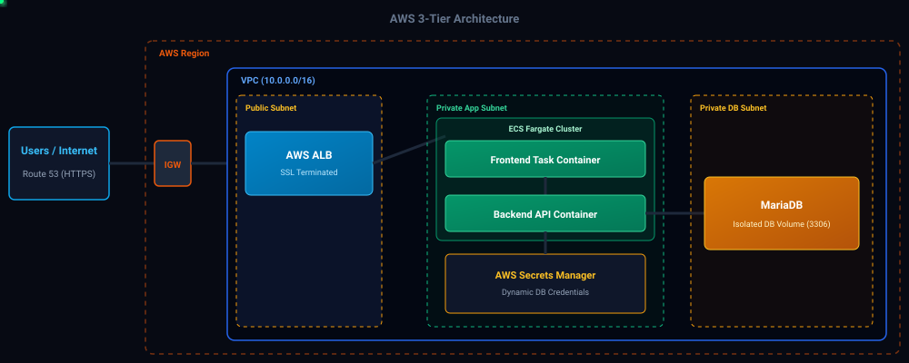
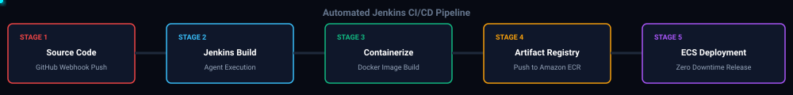

# 3-Tier Student Registration Application (AWS ECS Fargate)

A production-grade, highly available 3-Tier Web Application deployed on **AWS ECS Fargate** using an automated **Jenkins CI/CD Pipeline**. Built following enterprise security standards with zero hardcoded credentials and serverless compute.

---

## 🏗 Architecture & Design Flow

### Key Infrastructure Highlights
* **Serverless Compute:** Deployed on AWS ECS Fargate, eliminating manual EC2 / Auto Scaling Group overhead.
* **Secrets Management:** DB credentials injected at runtime via **AWS Secrets Manager** using Task Execution IAM Roles.
* **SSL & Traffic Routing:** **AWS Route 53** routes custom domain traffic to an **Application Load Balancer (ALB)** secured with **AWS Certificate Manager (ACM)** HTTPS.
* **Network Isolation:** Application tasks run in Private Subnets with restricted Security Groups.

---

## 🔄 Automated CI/CD Pipeline

1. **Developer Push:** Code commit triggers Jenkins pipeline.
2. **Build Agent Execution:** Jenkins Controller delegates job to a dedicated Docker build agent.
3. **Image Packaging:** Container image built and tagged automatically with commit hash.
4. **Amazon ECR Storage:** Docker image pushed securely to private Amazon ECR repository.
5. **Zero-Downtime Deployment:** Jenkins updates AWS ECS Service to trigger a rolling deployment.

---

## 🛠 Tech Stack

* **Frontend / Backend:** Student Registration Stack
* **Database:** MariaDB
* **CI/CD:** Jenkins (Controller-Agent Architecture)
* **Containerization:** Docker, Amazon ECR
* **Cloud Infrastructure:** AWS ECS (Fargate), AWS ALB, Route 53, ACM, AWS Secrets Manager, CloudWatch

---

## 📸 Deployment Proofs & Evidence

<b>👉 Click here to expand & view all AWS & Jenkins Live Deployment Proofs</b>

 

### 1. Application UI & SSL Domain Verification

### 2. AWS Route 53 & ACM SSL Setup

### 3. Application Load Balancer & Target Group

### 4. AWS ECS Cluster & Fargate Tasks

### 5. AWS Secrets Manager Integration

### 6. MariaDB Database Terminal Verification

### 7. Jenkins CI/CD Pipeline Execution

### 8. Amazon ECR Container Repositories

